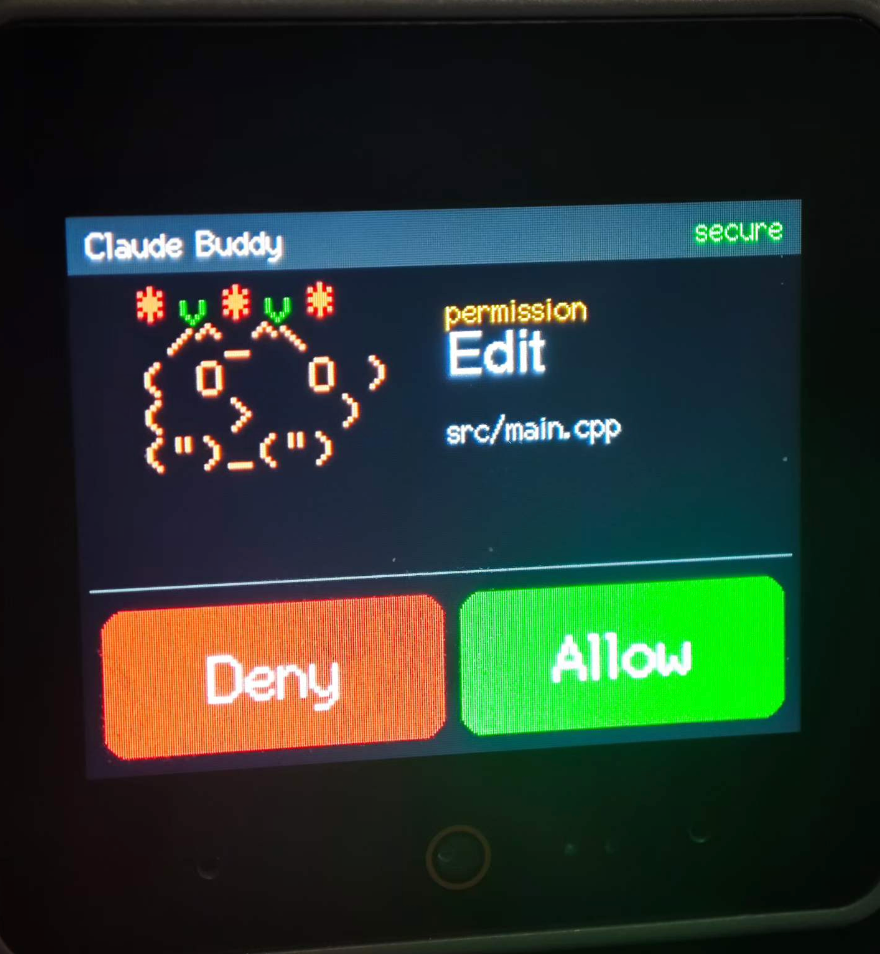

# Claude Desktop Buddy — multi-device ports

Open-source hardware companions for [Claude Desktop](https://claude.ai/download) that mirror session state and let you approve or deny tool-use permission prompts without reaching for the laptop. Implements Anthropic's [Hardware Buddy BLE protocol](https://github.com/anthropics/claude-desktop-buddy/blob/main/REFERENCE.md).

<p align="center">
  
</p>

---

## Supported devices

Each device gets its own subdirectory with a self-contained PlatformIO project.

| Folder | Hardware | Form factor | Status |
|---|---|---|---|
| [`cores3/`](cores3/) | **M5Stack CoreS3** — 2.0″ 320×240 touchscreen + speaker + IMU | Desktop device, ~¥500 | ✅ **Stable v1.0** |
| [`atoms3r-echo/`](atoms3r-echo/) | **M5Stack AtomS3R + Atom Echo Base** — 0.85″ 128×128, 1 button, speaker + mic | Magnetic monitor-edge clip, ~¥150 | ✅ **v0.1 verified** |
| [`zectrix-note4/`](zectrix-note4/) | **ZecTrix Note 4** — 4.2″ e-paper 400×300 + 3 buttons + speaker + mic | Always-on desk dashboard | ✅ **v0.1.3 verified** |

Pick the one that matches your hardware, `cd` into the folder, and follow the README there.

---

## How it works (shared across all ports)

### Protocol

Claude Desktop advertises a BLE Nordic UART Service. Any device that can:

1. Advertise NUS with a name starting with `Claude`
2. Accept LE Secure Connections pairing (6-digit passkey displayed on device)
3. Parse newline-delimited JSON heartbeats (session counters, token usage, optional `prompt` field)
4. Write back `{"cmd":"permission","id":"…","decision":"once|deny"}`

…is a valid buddy. See Anthropic's [REFERENCE.md](https://github.com/anthropics/claude-desktop-buddy/blob/main/REFERENCE.md) for the full wire protocol.

### Persona model

Every port derives the same four pet/device states from the heartbeat, but renders them according to the hardware's strengths:

| State | Trigger | CoreS3 | AtomS3R (planned) |
|---|---|---|---|
| **Sleep** | No snapshot in 30 s | Cat curled up, Zzz, wilted crown | Screen off / dim grey |
| **Idle** | Connected, nothing to do | Cat blinking, pink crown | Soft green fill + counter |
| **Busy** | `running > 0` | Cat paw-tapping, orange crown | Yellow fill + `running N` |
| **Attention** | Prompt or `waiting > 0` | Cat alert + red flickering crown | Red fill + tool name, button-to-approve |

### Input mapping

| Port | Allow | Deny |
|---|---|---|
| CoreS3 | Tap right touch zone | Tap left touch zone |
| AtomS3R | Short press (≤500 ms) | Long press (≥600 ms) |

---

## Project philosophy

- **One directory per device.** Each `<device>/` is a complete, independently-buildable PlatformIO project. No shared build system to wrestle with.
- **Shared code is duplicated, not linked.** The BLE bridge (`ble_bridge.cpp/h`) and JSON parsing logic are copied into each device directory. 180 lines × 2 devices is cheaper than a build-system dance. If a bug is fixed, apply the patch in both directories.
- **UI is hardware-native.** Don't try to pretend AtomS3R has the same screen as CoreS3 — design to each device's strengths.
- **The upstream BLE bridge is vendored verbatim.** Anthropic's Arduino BLE code from [anthropics/claude-desktop-buddy](https://github.com/anthropics/claude-desktop-buddy) is used unchanged — it compiles on any ESP32 variant.

---

## Adding a new device

Got an ESP32 board that isn't listed? The protocol requirements are minimal:

- **Must have**: BLE (so no ESP32-S2), some way to display OR indicate state (screen, LEDs, e-ink), some way to approve/deny (buttons, touch, capacitive pad)
- **Nice to have**: speaker for audio feedback, IMU for motion wake, PSRAM for smooth double-buffered rendering

Suggested template for adding a port:

```
<my-device>/
├── README.md              # hardware, pinout, build instructions, caveats
├── platformio.ini         # board + lib_deps
├── no_ota.csv             # partition table (optional)
└── src/
    ├── ble_bridge.cpp     # copy from cores3/src/, unchanged
    ├── ble_bridge.h       # copy from cores3/src/, unchanged
    └── main.cpp           # your UI + input handling
```

PRs welcome. Keep ports focused on one device family; don't try to make one binary cover multiple boards via `#ifdef` — separate folders scale better.

---

## Credits

- BLE bridge and protocol by [Anthropic](https://github.com/anthropics/claude-desktop-buddy), MIT.
- Cat ASCII art adapted from the upstream [`cat.cpp`](https://github.com/anthropics/claude-desktop-buddy/blob/main/src/buddies/cat.cpp).
- Everything else: MIT, do as you wish.
